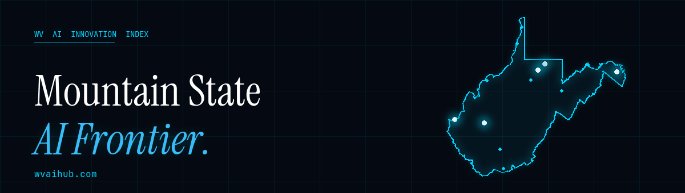

<p align="center">
  
</p>

# WV-AI-HUB

> An interactive map of AI innovation across West Virginia — twelve hubs, 53+ stories tracking the Mountain State's tech, research, data-center, and workforce ecosystems.

**🌐 Live: [wvaihub.com](https://wvaihub.com)** &nbsp;·&nbsp; Curated by Mountain State Freedom Tech.

The site is a single static HTML file. No framework, no build step, no backend. Drop it on any static host (Netlify, Cloudflare Pages, GitHub Pages, S3) and it works. The WV outline is rendered from real geographic coordinates on an HTML `<canvas>`. All content lives inline in `index.html` so the whole project can be read top-to-bottom in one file.

---

## What's inside

- **5 Major Hubs** — Morgantown · Fairmont · Charleston · Huntington · Berkeley County
- **7 Emerging Hubs** — Parkersburg · Wheeling · Weirton · Princeton · Beckley · Clarksburg · Tucker County
- **53+ Stories** across WVU & Marshall research, state AI policy (HB 2014, HB 4983, HB 5690), data-center buildouts, startup accelerators, and community organizing
- **Workforce Development** panel with **27 resource cards** across Jobs · Education · Events · Grants — spanning AI, Tech, Bitcoin, Solar, and Just Transition

---

## Run locally

Any static server works. The simplest:

```bash
python3 -m http.server 8000
# then open http://localhost:8000
```

VS Code users can install the **Live Server** extension and right-click `index.html` → "Open with Live Server."

---

## File structure

```
.
├── index.html                  Entire site (HTML + CSS + JS, ~1900 lines)
├── robots.txt                  Crawler directives → points to assets/sitemap.xml
├── DOCS.md                     Notes on the canvas-map rendering
├── README.md                   This file
├── LICENSE                     (TBD — see License section)
└── assets/
    ├── og-image.png            1200×630 social preview card
    ├── favicon.svg             Vector favicon
    ├── favicon-{16,32,48}.png  Browser-tab favicons
    ├── apple-touch-icon.png    iOS home-screen icon (180×180)
    ├── icon-{192,512}.png      PWA / Android home-screen icons
    ├── site.webmanifest        PWA manifest
    ├── sitemap.xml             Search-engine sitemap
    ├── readme-banner.png       Header of this README
    ├── montani-badge{,-dark}.png  Footer credit (light/dark mode)
    └── scripts/
        ├── generate_og.py            Rebuilds og-image.png from the WV polygon in index.html
        ├── generate_favicons.py      Rebuilds the favicon set + apple-touch + PWA icons
        ├── generate_readme_assets.py Rebuilds the README banner + MØNTAN1 badge
        └── fonts/                    Bundled brand fonts (OFL): Instrument Serif, JetBrains Mono, DM Sans
```

To regenerate any of the visual assets after editing the polygon, hub list, or branding:

```bash
python3 -m pip install Pillow
python3 assets/scripts/generate_og.py
python3 assets/scripts/generate_favicons.py
python3 assets/scripts/generate_readme_assets.py
```

---

## Fork this for your state, county, school, or community

The whole point of releasing the source is so anyone can clone this and stand up an innovation index for their own region. The pattern adapts cleanly to:

- **A state** (e.g. Vermont AI Innovation Index, North Carolina Renewable Energy Map)
- **A county or town** (e.g. Mercer County Tech Index, Charleston Bitcoin Map)
- **A school or university district** (e.g. WVU College of Engineering project tracker)
- **A community organization** (e.g. Tucker United issue tracker, Appalachian Trail volunteer hubs)
- **An industry vertical in a region** (e.g. solar installers in the Southeast, biotech in the Research Triangle)

### Step-by-step

1. **Fork and clone**
   ```bash
   gh repo fork m0ntan1/WV-AI-HUB-INDEX --clone
   cd WV-AI-HUB-INDEX
   ```

2. **Replace the geographic polygon.** Open `index.html` and find `const WV = [ ... ];` (around line 800). This is a list of `[longitude, latitude]` pairs tracing the WV state boundary. Replace it with your region's outline. Free sources:
   - **US states / counties / school districts** — [US Census TIGER/Line shapefiles](https://www.census.gov/geographies/mapping-files/time-series/geo/tiger-line-file.html), converted to GeoJSON via [mapshaper.org](https://mapshaper.org)
   - **Cities or neighborhoods** — [OpenStreetMap](https://www.openstreetmap.org) → search → export polygon
   - **Custom regions** — draw in [geojson.io](https://geojson.io) and copy the coordinates

3. **Update the hub data.** In `index.html` find the three JS arrays:
   - `const HUBS = [...]` — your 4–6 major hubs (name, lat, lng, story count, optional `capital: true`)
   - `const TOP10 = [...]` — your secondary cities (rendered as smaller dots between hubs)
   - `const TOWNS = [...]` — your tertiary towns (rendered as faint background dots)

4. **Rewrite the content sections.** Each `<section class="city-section">` is one major hub. Each `<div class="story-item">` is one story. Each `<div class="future-hub-card">` is an emerging hub. The Workforce Development section uses `<div class="wf-card">` blocks grouped into four `<div class="wf-panel">` panels.

5. **Update branding.** In `index.html`:
   - `<title>`, `<meta name="description">`, OG/Twitter tags
   - Hero text: "West Virginia's AI Frontier"
   - Footer: "Montani Semper Liberi" + curator name
   - JSON-LD `Organization` block: name, url, email, sameAs links
   - CSS color variables in `:root { ... }` if you want a different palette

6. **Regenerate visual assets.** After your edits land:
   ```bash
   python3 -m pip install Pillow
   python3 assets/scripts/generate_og.py            # new social card
   python3 assets/scripts/generate_favicons.py      # new favicons (or skip if you'll design your own)
   python3 assets/scripts/generate_readme_assets.py # new README banner
   ```

7. **Deploy.** The site is pure static files. Easiest options:
   - **Netlify** — `npx netlify deploy --prod --dir=.` or connect the GitHub repo for auto-deploy
   - **Cloudflare Pages** — connect GitHub repo in dashboard, framework preset "None"
   - **GitHub Pages** — enable in repo settings, branch `main`, folder `/` (root)
   - **Vercel** — `vercel --prod`

8. **Point a domain.** Netlify and Cloudflare Pages both give you free HTTPS + custom domain.

### Curation philosophy

Every story on this index links to a public, verifiable source (news article, university press release, government press release, organization homepage, meetup page). The goal is a citation-rich snapshot that a researcher, journalist, or policy staffer could trust as a starting point. When sources go stale or contradict the summary, the entry gets revised or pulled.

If you fork this, **keep your sources clickable.** That's what separates a community index from a marketing page.

---

## Local AI assistance

This index was built and continues to be maintained with Claude Code, an agentic AI from Anthropic. The repo's commit history shows the iteration: news refreshes, the move to a unified Workforce Development section, the em-dash + AI-prose sweep, the SEO and OG-image pass. If you're forking this and want the same workflow, the relevant capabilities are:

- **Single-file editing at scale** — Claude Code can rewrite, sort, and resync the city sections and JS arrays in one pass.
- **Source verification** — instruct it to WebFetch every source URL and report broken / stale / contradicted entries before you trust them.
- **Asset regeneration** — the Python scripts in `assets/scripts/` were generated and revised by Claude Code; rerun them whenever your underlying data changes.

You don't need an AI agent to fork this — the source is plain HTML — but it makes the per-region customization fast.

---

## License

See [LICENSE](LICENSE).

Brand fonts in `assets/scripts/fonts/` are distributed under the SIL Open Font License 1.1 (Instrument Serif, JetBrains Mono, DM Sans). They remain under their original licenses regardless of the license chosen for the rest of this repo.

---

## Credits

Curated by **Mountain State Freedom Tech** (formerly HODL in the Holler), the Morgantown Bitcoin and freedom-tech meetup operated by [MØNTAN1 Consulting](https://montanibitcoin.com). Contact: [rick@montaniai.com](mailto:rick@montaniai.com).

*Montani Semper Liberi.*

<p align="center">
  <a href="https://montaniai.com">
    <picture>
      <source media="(prefers-color-scheme: dark)" srcset="assets/montani-badge-dark.png">
      
    </picture>
  </a>
</p>
